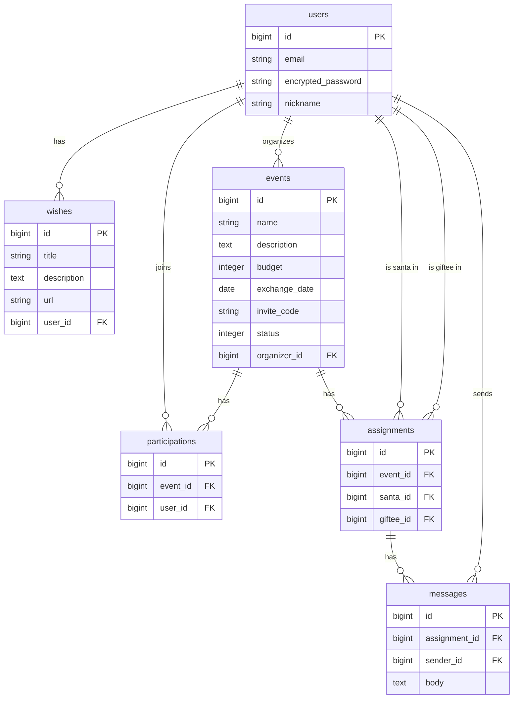

# Secret Santa

Сайт «Тайный Санта» с вишлистами и чатом (Ruby on Rails).

## Схема базы данных

```mermaid
erDiagram
  users ||--o{ wishes : "has"
  users ||--o{ events : "organizes"
  users ||--o{ participations : "joins"
  events ||--o{ participations : "has"
  events ||--o{ assignments : "has"
  users ||--o{ assignments : "is santa in"
  users ||--o{ assignments : "is giftee in"
  assignments ||--o{ messages : "has"
  users ||--o{ messages : "sends"

    users {
        bigint id PK
        string email
        string encrypted_password
        string nickname
    }
    wishes {
        bigint id PK
        string title
        text description
        string url
        bigint user_id FK
    }
  events {
    bigint id PK
    string name
    text description
    integer budget
    date exchange_date
    string invite_code
    integer status
    bigint organizer_id FK
  }
  participations {
    bigint id PK
    bigint event_id FK
    bigint user_id FK
  }
  assignments {
    bigint id PK
    bigint event_id FK
    bigint santa_id FK
    bigint giftee_id FK
  }
  messages {
    bigint id PK
    bigint assignment_id FK
    bigint sender_id FK
    text body
  }
```